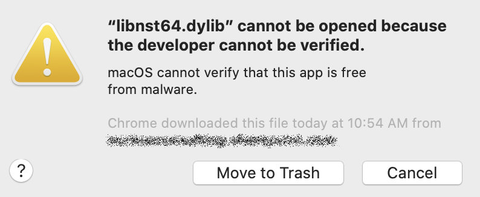
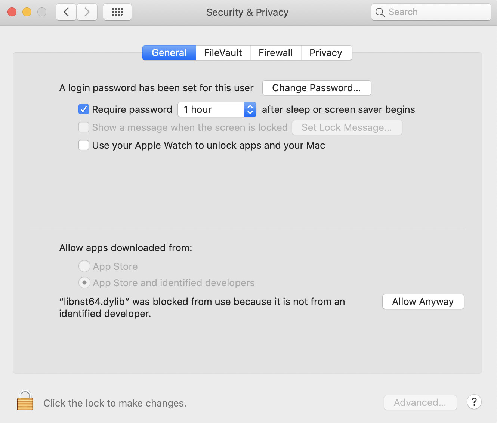
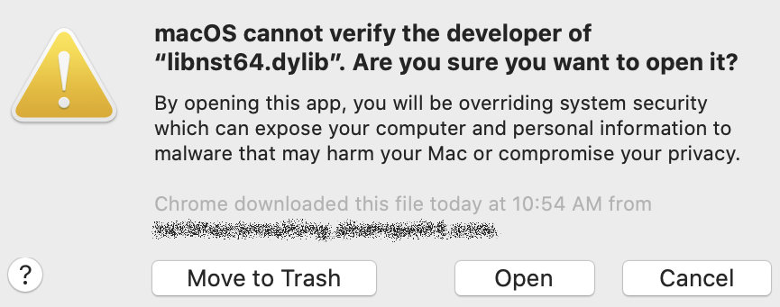

# Overview

With the latest version of Guidewire Studio/InsuranceSuite, the overall experience is reliable whereas earlier versions exhibit a few anomalies.

Here are a few additional notes:

## Browser Testing

In order to test Windows browsers locally, virtual machines such as [Parallels Desktop for Mac](https://www.parallels.com/products/desktop/) or [VMWare Fusion](https://www.vmware.com/products/fusion.html) are great options that perform well.

## macOS Catalina Security

Under macOS Catalina, be aware of improved security restrictions, which may affect starting Guidewire Studio and other tasks. There may be a need to approve Java library execution multiple times during initial Studio startup. See Apple tech note, "[Open a Mac app from an unidentified developer](https://support.apple.com/guide/mac-help/open-a-mac-app-from-an-unidentified-developer-mh40616/mac)."

For example, starting PolicyCenter 10.0.3 Studio for the first times calls for multiple authorizations and restarts. 

!> Repeat the following process for the Java application and dynamic libraries.

1. Launch Studio
```sh pc-studio```

2. Click the Cancel button when the first dialog box appears



3. Open Systems Preferences > Security & Privacy > General

4. Click the Allow Anyway button



5. Launch Studio
```sh pc-studio```

6. Click the Open button when the dialgo box appears




Repeat this process for the following libraries:

- libosxapp.dylib
- libfontmanager.dylib
- libnst64.dylib
- libvjvm.dylib
- libawt_lwawt.dylib